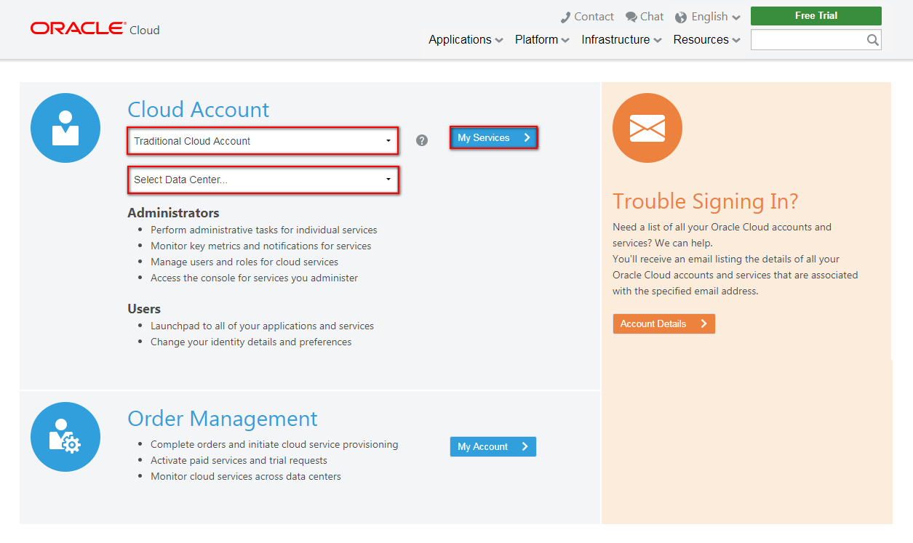
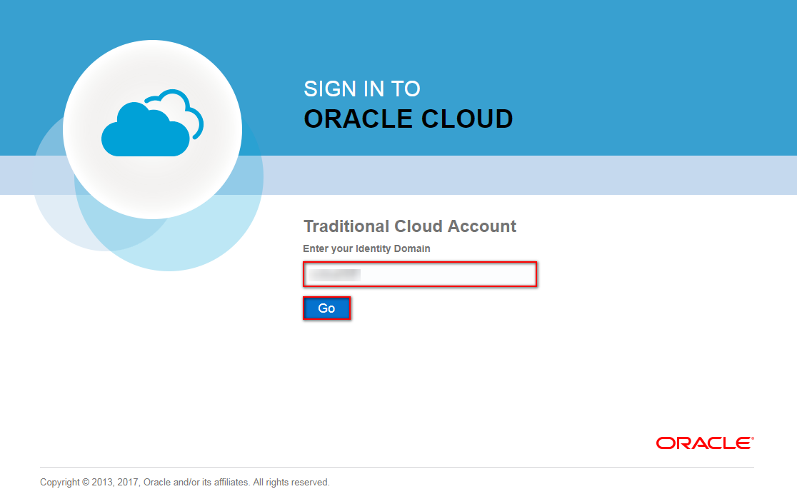
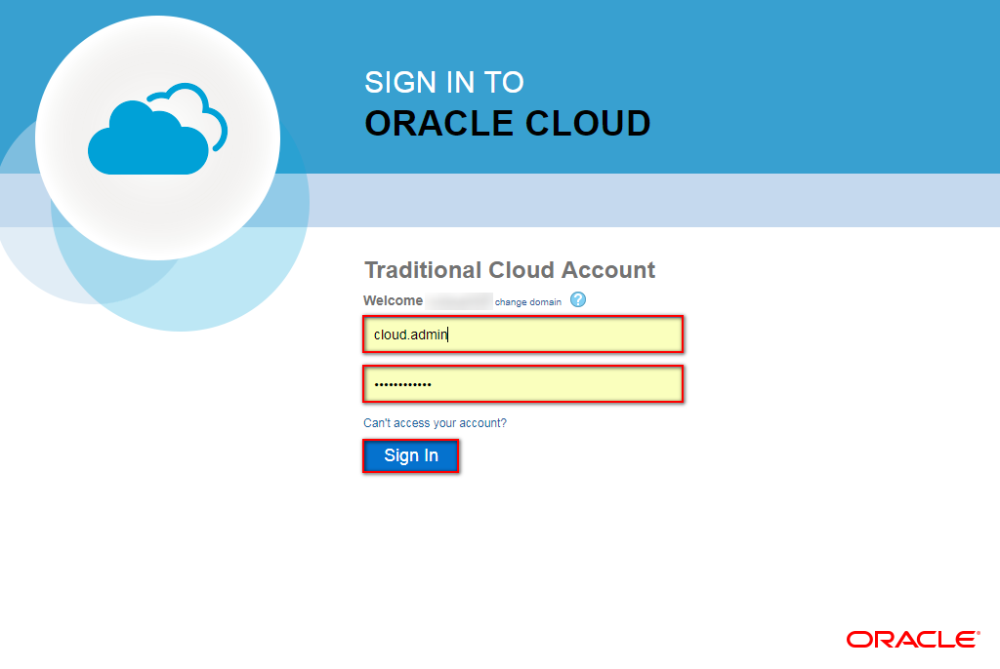
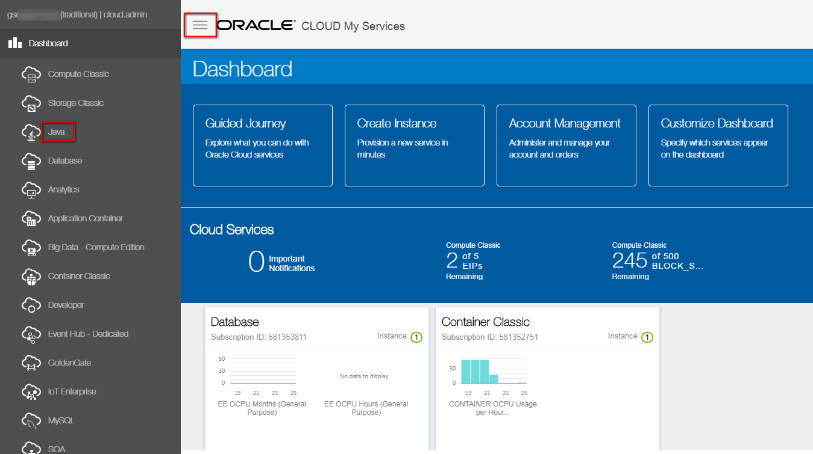
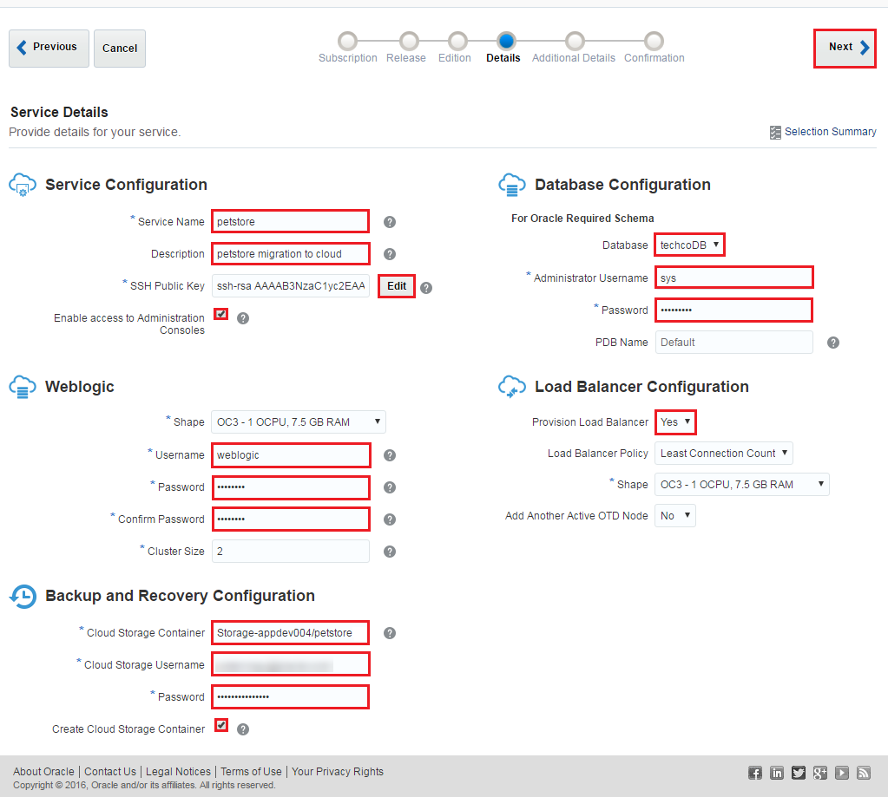
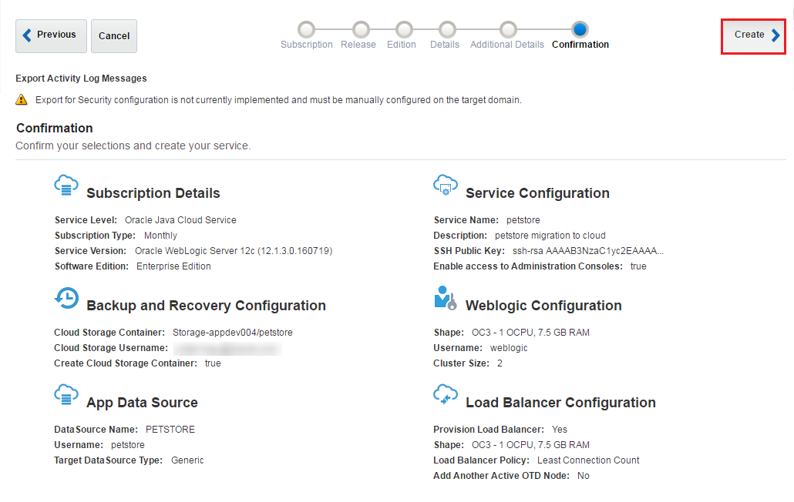

-----
# WARNING! THIS TUTORIAL IS DEPRECATED. 

##  HOL7680: Easy Migration: On-Premises Oracle WebLogic to Oracle Java Cloud Service  ##

### About this tutorial ###
In this use case you have a JEE5 application running on top of a Weblogic 10.3.6 installation and you want to migrate to Oracle Public Cloud Service using Java Cloud Service's AppToCloud feature. Oracle’s AppToCloud infrastructure allows you to export an existing domain configuration and Java applications, and to then provision a new Oracle Java Cloud Service instance with the same domain resources and applications. See the diagram which shows the on premise and the migrated architecture. The migration is completely done by Oracle's AppToCloud feature and requires minimal intervetion to achive the migration to the cloud.

This tutorial demonstrates how to:
  
+ export on premise Weblogic 10.3.6 domain including application bits using App2Cloud tool,
+ create Java Cloud Service instance using Oracle Java Cloud Service's AppToCloud function
+ import application running and exported as part of the on premise Weblogic 10.3.6 production domain.

### Steps ###

#### Create Weblogic 10.3.6 domain and deploy the Petstore sample application ####
Open a terminal and change to `/u01/content/cloud-native-devops-workshop/app-2-cloud` folder.

	$ [oracle@localhost Desktop]$ cd /u01/content/cloud-native-devops-workshop/app-2-cloud
	
Run the `runOnPremWLS.10.3.6.sh` script which starts the database, creates Weblogic 10.3.6 domain, starts Weblogic servers and deploys the Petstore demo application.

    $ [oracle@localhost app-2-cloud]$ ./runOnPremWLS.10.3.6.sh
	  Oracle database (sid: XE) is running.
	  Open pluggable database: PDBORCL.
    PDBORCL is already opened
	  ********** CREATING PetStore DB USER **********************************************
	  
	  User dropped.
	  
	  
	  User created.
	  
	  
	  Grant succeeded.
	  
	  ********** CREATING DB ENTRIES FOR PetStore Application ***************************
	  
	  SQL*Plus: Release 12.1.0.2.0 Production on Tue Oct 11 05:55:45 2016
	  
	  Copyright (c) 1982, 2014, Oracle.  All rights reserved.
	  
	  
	  Connected to:
	  Oracle Database 12c Enterprise Edition Release 12.1.0.2.0 - 64bit Production
	  With the Partitioning, OLAP, Advanced Analytics and Real Application Testing options
	  
	  SQL> 
	  Table created.
	  
	  
	  Table created.
	  
	  
	  Table created.
	  
	  
	  Table created.
	  
	  
	  Table created.
	  
	  
	  Table created.
	  
	  
	  Table created.
	  
	  
	  Table created.
	  
	  
	  Table created.
	  
	  
	  1 row created.
	  
	  ...
	  
	  1 row created.
	  
	  
	  Commit complete.
	  
	  SQL> Disconnected from Oracle Database 12c Enterprise Edition Release 12.1.0.2.0 - 64bit Production
	  With the Partitioning, OLAP, Advanced Analytics and Real Application Testing options
	  ********** CREATING PETSTORE_DOMAIN (WEBLOGIC 10.3.6 - PETSTORE_DOMAIN) ***********
	  << read template from "/u01/content/cloud-native-devops-workshop/app-2-cloud/template/petstore_domain_template.jar"
	  >>  succeed: read template from "/u01/content/cloud-native-devops-workshop/app-2-cloud/template/petstore_domain_template.jar"
	  << find User "weblogic" as u1_CREATE_IF_NOT_EXIST
	  >>  succeed: find User "weblogic" as u1_CREATE_IF_NOT_EXIST
	  << set u1_CREATE_IF_NOT_EXIST attribute Password to "********"
	  >>  succeed: set u1_CREATE_IF_NOT_EXIST attribute Password to "********"
	  << write Domain to "/u01/wins/wls1036/user_projects/domains/petstore_domain"
	  ...............................................................................................
	  >>  succeed: write Domain to "/u01/wins/wls1036/user_projects/domains/petstore_domain"
	  << close template
	  >>  succeed: close template
	  ********** STARTING ADMIN SERVER (WEBLOGIC 10.3.6 - PETSTORE_DOMAIN) **************
	  ********** STARTING MSERVER1 SERVER (WEBLOGIC 10.3.6 - PETSTORE_DOMAIN) ***********
	  ********** STARTING MSERVER2 SERVER (WEBLOGIC 10.3.6 - PETSTORE_DOMAIN) ***********
	  ********** ADMIN SERVER (WEBLOGIC 10.3.6 - DOMAIN1036) HAS BEEN STARTED ***********
	  ********** DEPLOY PETSTORE (WEBLOGIC 10.3.6 - PETSTORE_DOMAIN) ********************
	  
	  Initializing WebLogic Scripting Tool (WLST) ...
	  
	  Welcome to WebLogic Server Administration Scripting Shell
	  
	  Type help() for help on available commands
	  
	  ************************ Create resources for PETSTORE application *****************************************
	  Connecting to t3://localhost:7001 with userid weblogic ...
	  Successfully connected to Admin Server 'AdminServer' that belongs to domain 'petstore_domain'.
	  
	  Warning: An insecure protocol was used to connect to the 
	  server. To ensure on-the-wire security, the SSL port or 
	  Admin port should be used instead.
	  
	  Location changed to edit tree. This is a writable tree with 
	  DomainMBean as the root. To make changes you will need to start 
	  an edit session via startEdit(). 
	  
	  For more help, use help(edit)
	  
	  Starting an edit session ...
	  Started edit session, please be sure to save and activate your 
	  changes once you are done.
	  Saving all your changes ...
	  Saved all your changes successfully.
	  Activating all your changes, this may take a while ... 
	  The edit lock associated with this edit session is released 
	  once the activation is completed.
	  Activation completed
	  ************************ Deploy PETSTORE application *****************************************
	  Deploying application from /u01/wins/wls1036/wlserver_10.3/common/deployable-libraries/jsf-2.0.war to targets petstore_cluster (upload=false) ...
	  <Oct 11, 2016 5:57:20 AM PDT> <Info> <J2EE Deployment SPI> <BEA-260121> <Initiating deploy operation for application, jsf [archive: /u01/wins/wls1036/wlserver_10.3/common/deployable-libraries/jsf-2.0.war], to petstore_cluster .> 
	  .Completed the deployment of Application with status completed
	  Current Status of your Deployment:
	  Deployment command type: deploy
	  Deployment State       : completed
	  Deployment Message     : [Deployer:149194]Operation 'deploy' on application 'jsf [LibSpecVersion=2.0,LibImplVersion=1.0.0.0_2-0-2]' has succeeded on 'mserver2'
	  Deploying application from /u01/content/cloud-native-devops-workshop/app-2-cloud/petstore.12.war to targets petstore_cluster (upload=false) ...
    <Oct 11, 2016 5:57:23 AM PDT> <Info> <J2EE Deployment SPI> <BEA-260121> <Initiating deploy operation for application, Petstore [archive: /u01/content/cloud-native-devops-workshop/app-2-cloud/petstore.12.war], to petstore_cluster .> 
	  ...Completed the deployment of Application with status completed
	  Current Status of your Deployment:
	  Deployment command type: deploy
	  Deployment State       : completed
	  Deployment Message     : [Deployer:149194]Operation 'deploy' on application 'Petstore' has succeeded on 'mserver2'
	  Starting application Petstore.
	  <Oct 11, 2016 5:57:33 AM PDT> <Info> <J2EE Deployment SPI> <BEA-260121> <Initiating start operation for application, Petstore [archive: null], to petstore_cluster .> 
	  .Completed the start of Application with status completed
	  Current Status of your Deployment:
	  Deployment command type: start
	  Deployment State       : completed
	  Deployment Message     : [Deployer:149194]Operation 'start' on application 'Petstore' has succeeded on 'mserver2'
	  No stack trace available.
	  <Oct 11, 2016 5:57:36 AM PDT> <Warning> <JNDI> <BEA-050001> <WLContext.close() was called in a different thread than the one in which it was created.> 
	  ********** OPEN PETSTORE APPLICATION AT http://localhost:7003/petstore/faces/catalog.jsp
	  [oracle@localhost app-2-cloud]$ 

Now check the Petstore demo application. Open a browser and enter *http://localhost:7003/petstore/faces/catalog.jsp* URL to hit the application.

Note in the virtualbox environment there is no load balancer configured for the cluster which contains 2 managed servers. The 7003 and 7004 port are the direct access to the managed servers. 

#### Export the domain and database ####

In this step a prepared script will complete the following steps:

1. App2Cloud tool checks the health of the running WebLogic domain created in the previous step.
2. After the healthcheck export the domain including the custom deployments and upload to the Oracle Public Cloud Storage container.
3. Export and import the on-premise database to the Oracle Public Cloud Database Service.

The database export/import in this simplified case means the sample SQL script upload and execution which prepares the Oracle Public Cloud Database Service.

Now run the `exportAndUploadWLS.10.3.6.Domain.sh` to check, export the existing domain and prepare the Oracle Public Database Cloud Service. Because the script will interact the assigned Oracle Public Cloud Services you need to provide the credentials and identity domain allocated to you by the instructor:

	[oracle@localhost app-2-cloud]$ ./exportAndUploadWLS.10.3.6.Domain.sh <USER> <PASSWORD> <DOMAIN_ID>
	********** CREATE 'app2cloud' CLOUD STORAGE CONTAINER TO UPLOAD ARTIFACTS ***********
	AUTH Token for storage:  AUTH_tka1972ac23bd04f640c7ce39ac2d25291
	> PUT /v1/Storage-gse00012306/app2cloud HTTP/1.1
	< HTTP/1.1 202 Accepted
	<html><h1>Accepted</h1>
The request is accepted for processing.
</html>
	********** HEALTHCHECK OF THE ON_PREMISE WLS 10.3.6 DOMAIN ***********
	JDK version is 1.8.0_102-b14
	A2C_HOME is /u01/oracle_jcs_app2cloud
	/usr/java/latest/bin/java -Xmx512m -cp /u01/oracle_jcs_app2cloud/jcs_a2c/modules/features/jcsa2c_lib.jar -Djava.util.logging.config.class=oracle.jcs.lifecycle.util.JCSLifecycleLoggingConfig oracle.jcs.lifecycle.healthcheck.AppToCloudHealthCheck -oh /u01/wins/wls1036 -adminUrl t3://localhost:7001 -adminUser weblogic -outputDir /u01/jcs_a2c_output
	The a2c-healthcheck program will write its log to /u01/oracle_jcs_app2cloud/logs/jcsa2c-healthcheck.log
	Enter the password for WebLogic user weblogic: Checking Domain Health
	Connecting to domain
	
	Connected to the domain petstore_domain
	
	Checking Java Configuration
	...
	checking server runtime : mserver2
	...
	checking server runtime : mserver1
	...
	checking server runtime : AdminServer
	Done Checking Java Configuration
	Checking Servers Health
	
	Done checking Servers Health
	Checking Applications Health
	Checking jsf#2.0@1.0.0.0_2-0-2
	Checking Petstore
	Done Checking Applications Health
	Checking Datasource Health
	Done Checking Datasource Health
	Checking JMS Health
	
	
	
	Done Checking JMS Health
	Done Checking Domain Health
	
	Activity Log for HEALTHCHECK
	
	Informational Messages:
	
	  1. JCSLCM-04037: Health Check Completed
	
	An HTML version of this report can be found at /u01/jcs_a2c_output/reports/petstore_domain-healthcheck-activityreport.html
	
	Output archive saved as /u01/jcs_a2c_output/petstore_domain.zip.  You can use this archive for the a2c-export tool.
	
	
	a2c-healthcheck completed successfully (exit code = 0)
	********** EXPORT ON_PREMISE WLS 10.3.6 DOMAIN ***********
	JDK version is 1.8.0_102-b14
	A2C_HOME is /u01/oracle_jcs_app2cloud
	/usr/java/latest/bin/java -Xmx512m -cp /u01/oracle_jcs_app2cloud/jcs_a2c/modules/features/jcsa2c_lib.jar -Djava.util.logging.config.class=oracle.jcs.lifecycle.util.JCSLifecycleLoggingConfig oracle.jcs.lifecycle.discovery.AppToCloudExport -oh /u01/wins/wls1036 -domainDir /u01/wins/wls1036/user_projects/domains/petstore_domain -archiveFile /u01/jcs_a2c_output/petstore_domain.zip -cloudStorageContainer Storage-gse00012306/app2cloud -cloudStorageUser cloud.admin
	The a2c-export program will write its log to /u01/oracle_jcs_app2cloud/logs/jcsa2c-export.log
	Enter the password for Oracle Storage Cloud user cloud.admin: ####<Sep 25, 2017 7:00:47 PM> <INFO> <AppToCloudExport> <getModel> <JCSLCM-02005> <Creating new model for domain /u01/wins/wls1036/user_projects/domains/petstore_domain>
	####<Sep 25, 2017 7:00:47 PM> <INFO> <EnvironmentModelBuilder> <populateOrRefreshFromEnvironment> <FMWPLATFRM-08552> <Try to discover a WebLogic Domain in offline mode>
	####<Sep 25, 2017 7:00:56 PM> <INFO> <EnvironmentDiscovery> <discoverDomain> <FMWPLATFRM-08683> <Discovering domain-level settings for domain petstore_domain-domain>
	####<Sep 25, 2017 7:00:57 PM> <INFO> <EnvironmentDiscovery> <discoverDomain> <FMWPLATFRM-08694> <Discovering servers for domain petstore_domain-domain>
	####<Sep 25, 2017 7:01:19 PM> <INFO> <EnvironmentDiscovery> <discoverDomain> <FMWPLATFRM-08696> <Discovering migratable targets for domain petstore_domain-domain>
	####<Sep 25, 2017 7:01:19 PM> <INFO> <EnvironmentDiscovery> <discoverDomain> <FMWPLATFRM-08695> <Discovering clusters for domain petstore_domain-domain>
	####<Sep 25, 2017 7:01:19 PM> <INFO> <EnvironmentDiscovery> <discoverDomain> <FMWPLATFRM-08698> <Discovering partitions for domain petstore_domain-domain>
	####<Sep 25, 2017 7:01:19 PM> <INFO> <EnvironmentDiscovery> <discoverDomain> <FMWPLATFRM-08697> <Discovering node managers for domain petstore_domain-domain>
	####<Sep 25, 2017 7:01:20 PM> <INFO> <EnvironmentDiscovery> <discoverDomain> <FMWPLATFRM-08680> <Discovering applications for domain petstore_domain-domain>
	####<Sep 25, 2017 7:01:20 PM> <INFO> <EnvironmentDiscovery> <discoverDomain> <FMWPLATFRM-08686> <Discovering shared libraries for domain petstore_domain-domain>
	####<Sep 25, 2017 7:01:20 PM> <INFO> <EnvironmentDiscovery> <discoverDomain> <FMWPLATFRM-08682> <Discovering data sources for domain petstore_domain-domain>
	####<Sep 25, 2017 7:01:21 PM> <INFO> <EnvironmentDiscovery> <discoverDomain> <FMWPLATFRM-08693> <Discovering work managers for domain petstore_domain-domain>
	####<Sep 25, 2017 7:01:21 PM> <INFO> <EnvironmentDiscovery> <discoverDomain> <FMWPLATFRM-08689> <Discovering persistent stores for domain petstore_domain-domain>
	####<Sep 25, 2017 7:01:21 PM> <INFO> <EnvironmentDiscovery> <discoverDomain> <FMWPLATFRM-08691> <Discovering startup and shutdown classes for domain petstore_domain-domain>
	####<Sep 25, 2017 7:01:21 PM> <INFO> <EnvironmentDiscovery> <discoverDomain> <FMWPLATFRM-08685> <Discovering JMS configuration for domain petstore_domain-domain>
	####<Sep 25, 2017 7:01:21 PM> <INFO> <EnvironmentDiscovery> <discoverDomain> <FMWPLATFRM-08684> <Discovering foreign JNDI providers for domain petstore_domain-domain>
	####<Sep 25, 2017 7:01:21 PM> <INFO> <EnvironmentDiscovery> <discoverDomain> <FMWPLATFRM-08687> <Discovering mail sessions for domain petstore_domain-domain>
	####<Sep 25, 2017 7:01:21 PM> <INFO> <EnvironmentDiscovery> <discoverDomain> <FMWPLATFRM-08681> <Discovering Coherence clusters for domain petstore_domain-domain>
	####<Sep 25, 2017 7:01:21 PM> <INFO> <EnvironmentDiscovery> <discoverDomain> <FMWPLATFRM-08692> <Discovering WLDF modules for domain petstore_domain-domain>
	####<Sep 25, 2017 7:01:21 PM> <INFO> <EnvironmentDiscovery> <discoverDomain> <FMWPLATFRM-08690> <Discovering server classpath and system property settings for domain petstore_domain-domain>
	####<Sep 25, 2017 7:01:21 PM> <INFO> <EnvironmentModelBuilder> <populateOrRefreshFromEnvironment> <FMWPLATFRM-08550> <End of the Environment discovery>
	####<Sep 25, 2017 7:01:22 PM> <WARNING> <ModelNotYetImplementedFeaturesScrubber> <transform> <JCSLCM-00579> <Export for Security configuration is not currently implemented and must be manually configured on the target domain.>
	####<Sep 25, 2017 7:01:22 PM> <SEVERE> <ModelLibraryConflictScrubber> <checkWebAppArchive> <> <oracle.jcs.lifecycle.scrubber.ModelLibraryConflictScrubber>
	####<Sep 25, 2017 7:01:22 PM> <INFO> <AppToCloudExport> <archiveApplications> <JCSLCM-02003> <Adding application to the archive: Petstore from /u01/content/cloud-native-devops-workshop/app-2-cloud/petstore.12.war>
	####<Sep 25, 2017 7:01:22 PM> <WARNING> <AppToCloudExport> <archiveApplications> <JCSLCM-02002> <Failed to find application at /u01/content/cloud-native-devops-workshop/app-2-cloud/petstore.12.war: {2}. The file will not be included in the export archive.>
	####<Sep 25, 2017 7:01:22 PM> <INFO> <AppToCloudExport> <archiveSharedLibraries> <JCSLCM-02003> <Adding library to the archive: jsf#2.0@1.0.0.0_2-0-2 from /u01/wins/wls1036/wlserver_10.3/common/deployable-libraries/jsf-2.0.war>
	####<Sep 25, 2017 7:01:22 PM> <INFO> <AppToCloudExport> <run> <JCSLCM-02009> <Successfully exported model and artifacts to /u01/jcs_a2c_output/petstore_domain.zip. Overrides file written to /u01/jcs_a2c_output/petstore_domain.json>
	####<Sep 25, 2017 7:01:22 PM> <INFO> <AppToCloudExport> <run> <JCSLCM-02028> <Uploading override file to cloud storage from /u01/jcs_a2c_output/petstore_domain.json>
	####<Sep 25, 2017 7:01:25 PM> <INFO> <AppToCloudExport> <run> <JCSLCM-02028> <Uploading archive file to cloud storage from /u01/jcs_a2c_output/petstore_domain.zip>
	####<Sep 25, 2017 7:01:25 PM> <INFO> <AppToCloudExport> <run> <JCSLCM-02009> <Successfully exported model and artifacts to https://gse00012306.storage.oraclecloud.com. Overrides file written to Storage-gse00012306/app2cloud/petstore_domain.json>
	
	Activity Log for EXPORT
	
	Informational Messages:
	
	  1. JCSLCM-02030: Uploaded override file to Oracle Cloud Storage container Storage-gse00012306/app2cloud
	  2. JCSLCM-02030: Uploaded archive file to Oracle Cloud Storage container Storage-gse00012306/app2cloud
	  3. JCSLCM-02031: Export Completed
	
	Warning Messages:
	
	  1. JCSLCM-02002: Failed to find application at /u01/content/cloud-native-devops-workshop/app-2-cloud/petstore.12.war: {2}. The file will not be included in the export archive.
	
	Features Not Yet Implemented Messages:
	
	  1. JCSLCM-00579: Export for Security configuration is not currently implemented and must be manually configured on the target domain.
	
	An HTML version of this report can be found at /u01/jcs_a2c_output/reports/petstore_domain-export-activityreport.html
	
	Successfully exported model and artifacts to https://gse00012306.storage.oraclecloud.com. Overrides file written to Storage-gse00012306/app2cloud/petstore_domain.json
	
	
	a2c-export completed successfully (exit code = 0)
	********** DATABASE CLOUD SERVICE PREPARATION ***********
	Database Cloud Service IP address: 129.158.73.174
	Warning: Permanently added '129.158.73.174' (RSA) to the list of known hosts.
	create_user.sh                                                                                                                                100%  301     3.6KB/s   00:00    
	create_user.sql                                                                                                                               100%  101     1.3KB/s   00:00    
	petstore.sql                                                                                                                                  100%   55KB 184.6KB/s   00:00    
	
	SQL*Plus: Release 12.1.0.2.0 Production on Mon Sep 25 23:01:30 2017
	
	Copyright (c) 1982, 2014, Oracle.  All rights reserved.
	
	
	Connected to:
	Oracle Database 12c Enterprise Edition Release 12.1.0.2.0 - 64bit Production
	With the Partitioning, OLAP, Advanced Analytics and Real Application Testing options
	
	SQL> DROP USER petstore cascade
	          *
	ERROR at line 1:
	ORA-01918: user 'PETSTORE' does not exist
	
	
	SQL> SQL> 
	User created.
	
	SQL> 
	Grant succeeded.
	
	SQL> Disconnected from Oracle Database 12c Enterprise Edition Release 12.1.0.2.0 - 64bit Production
	With the Partitioning, OLAP, Advanced Analytics and Real Application Testing options
	
	SQL*Plus: Release 12.1.0.2.0 Production on Mon Sep 25 23:01:31 2017
	
	Copyright (c) 1982, 2014, Oracle.  All rights reserved.
	
	
	Connected to:
	Oracle Database 12c Enterprise Edition Release 12.1.0.2.0 - 64bit Production
	With the Partitioning, OLAP, Advanced Analytics and Real Application Testing options
	
	SQL> SQL>   2    3    4    5    6    7  
	Table created.
	
	...
	
	SQL> 
	1 row created.
	
	SQL> SQL> 
	Commit complete.
	
	SQL> Disconnected from Oracle Database 12c Enterprise Edition Release 12.1.0.2.0 - 64bit Production
	With the Partitioning, OLAP, Advanced Analytics and Real Application Testing options

	[oracle@localhost bin]$ 

After the successful export you are ready to create an Oracle Java Cloud Service instance.

#### Creating an Oracle Java Cloud Service Instance with AppToCloud ####

In order to import your source domain configuration and applications into Oracle Java Cloud Service, you must associate a new service instance with the files that you previously generated with the AppToCloud tools.

Most of the steps that you use to create a service instance with AppToCloud are the same as those you use to create a standard service instance. However, there are some additional steps:

- You must provide the location of your AppToCloud JSON file on Oracle Storage Cloud Service.
- You must associate each Data Source in your original WebLogic Server domain with an existing Oracle Database Cloud - Database as a Service database deployment.

Open a browser and sign in to [Oracle Public Cloud Services](https://cloud.oracle.com/sign-in). 
Select *Traditional Cloud Account* type and the datacenter where your services are available. Oracle Public Cloud Services details are given by the instructor.
Click **My Services**.

Enter the name of the identity domain. Click **Go**.

Provide the username and password and click **Sign In**.

On the dashboard click the menu on the top left corner. The list of services will fly in from the left. Select **Java**.

If this is your first time to open the console the Welcome page appears. Click on **Go To Console** or **Services**.

Click **Create Service** and select the **Java Cloud Service — AppToCloud** option.

Provide details about the JSON file generated by the Export tool. Enter the fully-qualified name of the JSON file that was uploaded to Oracle Storage Cloud Service. The script in the previous step uploaded to: `Storage-<DOMAIN_ID>/app2cloud/petstore_domain.json`. Enter the user name and password of the cloud user assigned to you by the instructor.

Select **Service Level** and **Billing Frequency**. Click **Next**.

Select version 12.1.3 for **Software Release**. Click **Next**.

Select **Software Edition**. Click **Next**.

On the Java Cloud Service Details page complete the necessary fields.

- Service name: **petstore**
- Description: optional.
- SSH public key. Click the **Edit** button to open the SSH public key dialog and select the **Create a New Key** option. In this case the key will be generated for you what you need to download. Download anywhere you want the key is not needed in the lab.
- Enable access to Administration Consoles: enable.
- Shape: use the default, small instance.
- Username: Weblogic administrator username. For example: *weblogic*
- Password: Weblogic administrator password. For example: *welcome1*
- Cluster size: leave the 2 which is based on the JSON configuration file.
- Cloud Storage container: the path of the container to store backup and configuration related to this Java Cloud Service. Name it to `petstore`. Format is: `Storage-<IDENTITY_DOMAIN>/petstore`.
- Cloud Storage Username: name of a cloud user that has access to this storage container.
- Cloud Storage Password: password of a cloud user that has access to this storage container.
- Create Cloud Storage Container: enable to create the container defined above for Java Cloud Service.
- Database: Database Cloud Service for required schema. As we recommended use the same what was prepared previously for Petstore demo application.
- Database Administrator Username: **sys**.
- Database Password: the password of Database Administrator which is *Welcome_1*.
- PDB Name: leave *Default* which is usually PDB1.
- Provision Load Balancer: Yes.
- Load Balancer details: leave the default.
 

On the **Additional Service Details** screen, select the first **Application Data Source**: *PETSTORE*. Complete the following parameters:

- DBCS Instance: select the Database Cloud Service DBCS Instance for Petstore application and which was also selected to host JRF required schemas on the previous screen.
- Username: **petstore**. This data source will connect to the database as this user.
- Password: the password of Database Administrator. If you have not changed the value in the `environment.properties` then it is *Welcome_1*. (The script has set the same password for **petstore** schema.)
- PDB: leave the **default**.

Click **OK** to accept your changes. Click **Next**.

The Confirmation page is displayed. If you are satisfied with your choices click **Create**.

You can use the **Activity** tab to monitor the progress and status of the creation of your service instance. After your service instance is provisioned and is running, you are ready to import the AppToCloud artifacts into the service instance.

#### Importing Applications into a Service Instance ####

After creating an AppToCloud service instance in Oracle Java Cloud Service, perform an import to automatically update the service instance with the applications and other domain resources collected from your on-premises environment.

Locate the AppToCloud service instance that you created previously. Click the hamburger Menu icon adjacent to the service instance name and select **AppToCloud Import**.

When prompted for confirmation, click **Yes**.

Monitor the progress of the import with the Activity tab. After a successful import, the applications and other domain resources found in your source domain are deployed to your service instance.

To check the Petstore application deployed on Java Cloud Service first we need to get the public IP address of the Load Balancer. Click on the **petstore** Java Cloud Service.

Note the Public IP of the Load Balancer.

Open a browser and enter the Public IP address of the Load Balancer and append `/petstore/faces/catalog.jsp` to hit the application. The URL should look like this: `http://140.86.0.54/petstore/faces/catalog.jsp`. Don't forget to use your Load Balancer's IP address. 

Congratulations! You have successfully migrated your on-premises JEE5 application to Oracle Java Cloud Service using AppToCloud feature.

For more information about AppToCloud migration see the [documentation](http://docs.oracle.com/cloud/latest/jcs_gs/JSCUG/GUID-C1F6804C-8D1C-457C-AC4A-28DD85691D09.htm#JSCUG-GUID-C1F6804C-8D1C-457C-AC4A-28DD85691D09).
